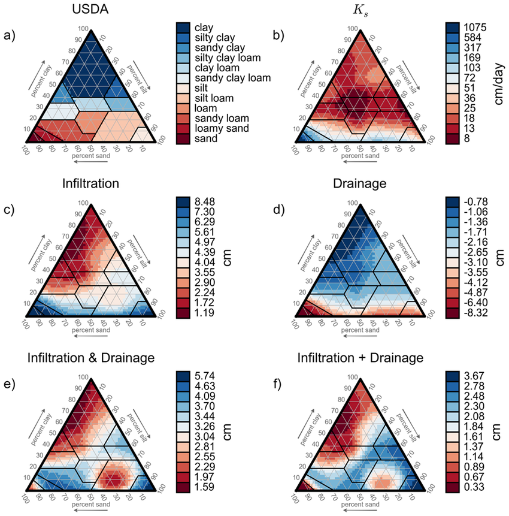
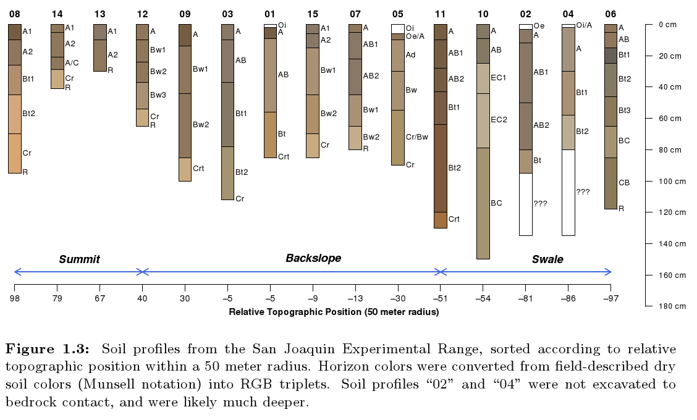
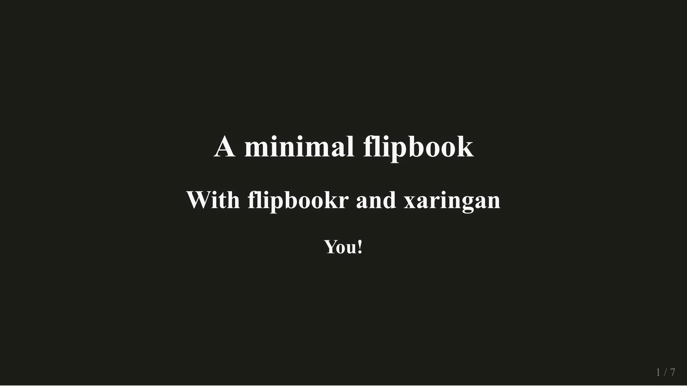

```{r setup, include = FALSE}
library(flipbookr)
library(tidyverse)
library(munsell)
knitr::opts_chunk$set(fig.width = 6, message = FALSE, 
                      warning = FALSE, comment = "", 
                      cache = F)
```

```{css, eval = TRUE, echo = FALSE}
.remark-code{line-height: 1; font-size: 50%}
@media print {
  .has-continuation {
    display: block;
  }
}
```
---
class:inverse, middle, center

# Sobre Soil Biophysics Lab


*Laboratorio de Biofísica de Suelos*

*PI: Dr. Carlos Bonilla*

.fade[Pontificia Universidad Católica de Chile<br>Santiago, Chile]

[`r icons::fontawesome("link")` biofisica.ing.puc.cl](https://biofisica.ing.puc.cl)
[`r icons::fontawesome("twitter")` @soilbiophysics1](https://twitter.com/soilbiophysics1)
[`r icons::icon_style(icons::fontawesome("instagram"), scale = 1)` @soilbiophysicslab](https://www.instagram.com/soilbiophysicslab)
---
.pull-left[
## Pandemia
1. Interacciones entre pares limitadas
2. Dificultades para los alumnos nuevos
]

.pull-right.center[
```{r, echo = FALSE, out.width="75%",fig.align='center'}

```
]

---
.pull-left[
## Ideas
1. Crear repositorio de live coding
2. Compartir código entre pares
]

.pull-right.center[
```{r, echo = FALSE, out.width="75%",fig.align='center'}
knitr::include_graphics("img/8401.jpg")
```
<a style="padding-bottom:40px; font-size: 15px;" href="http://www.freepik.com">Designed by pch.vector / Freepik</a>
]
---
.pull-left[
### Triángulo de textura
```{r, echo = FALSE, out.width="90%",fig.align='center'}

```
<a style="padding-bottom:40px; font-size: 15px;" href="http://journals.plos.org/plosone/article?id=10.1371/journal.pone.0131299">Groenendyk et al., 2015</a>

]
.pull-right.center[
### Perfiles de suelo
```{r, echo = FALSE, out.width="90%",fig.align='center'}

```
<a style="padding-bottom:40px; font-size: 15px;" href="http://ncss-tech.github.io/AQP/">NCSS, 2021</a>
]
---
.pull-left[
### Canal de youtube
<iframe width="380" height="260" align="center" src="https://www.youtube.com/embed/ajixrDLwsVg" frameborder="0" allow="accelerometer; autoplay; encrypted-media; gyroscope; picture-in-picture" allowfullscreen></iframe>
]

.pull-right.center[
### Live Coding + paquete {flipbookr}
```{r, echo = FALSE, out.width="90%",fig.align='center'}

```

]
---
```{r,echo=FALSE,warning=FALSE, message=FALSE}
datos_suelo <- data.frame(
  suelo = c("suelo a", "suelo a", "suelo b", "suelo b"), # importante para agrupar datos
  arena = c(15, 18, 57, 32),
  limo = c(52, 70, 8, 26),
  arcilla = c(33, 12, 35, 42),
  om = c(1, 3, 4, 11),
  bd = c(1.33, 1.38, 1.76, 1.15),
  limite_superior = c(0,10,0,25),
  limite_inferior = c(10,35,25,55),
  horizontes = c("Ap","Bt", "A","B"),
  munsell = c('5YR 3/2','5YR 7/2', '2.5YR 6/2','10YR 7/2') 
)

datos_suelo_plot <- datos_suelo %>% 
  mutate(espesor = limite_inferior - limite_superior) %>% 
  mutate(munsell_hex=mnsl(munsell))

```
.pull-left[
```{r plot-label-5, eval=FALSE,warning=FALSE, message=FALSE}
ggplot(
  data = datos_suelo_plot,
  aes(
    x=suelo,
    y=-espesor,
    fill=fct_reorder(horizontes,limite_inferior,.desc=TRUE)) # asegurar el orden de los horizontes
  )+
  geom_col(
    width=0.2
  ) +
  geom_text(
    aes(y=-(limite_superior + espesor/2),label=horizontes) # se centran las etiquetas
  ) +
guides(fill=FALSE) +  # sacamos la leyenda
scale_fill_manual( # se definen los colores munsell
  breaks=datos_suelo_plot$horizontes,
  values=datos_suelo_plot$munsell_hex) +
scale_y_continuous(labels = abs) + # profundidad con valores positivos
labs(
title = "Suelos muestreados",
y = "Profundidad (cm)",
x=""
  ) +
geom_hline(yintercept = -45, color = "blue") + # agregamos una linea
geom_text(aes(x = -Inf, y=-44, hjust = 0),label=" tabla de agua", color = "blue") + # describimos la linea
theme_bw()
  
```
]

.pull-right[
```{r plot-label-5-out, ref.label="plot-label-5", echo=FALSE,warning=FALSE, message=FALSE}
```
]

---
`r chunk_reveal(chunk_name = "plot-label-5", title = "###Paso a paso")`
---
.pull-left[
## Recepción
1. Mejor de lo esperado, incluso material de otros temas
2. Colaboración con [otros pares](https://bjnnowak.netlify.app/2021/07/26/r-plotting-soil-textures-example-of-water-storage-capacity/)
]

.pull-right[
```{r, echo = FALSE, out.width="75%"}
knitr::include_graphics("img/8401.jpg")
```
]
---
class: goodbye-slide, inverse, middle, right

### Dudas? Comentarios? Puedes contactarnos en:

.left[
[`r icons::fontawesome("link")` biofisica.ing.puc.cl](https://biofisica.ing.puc.cl)
[`r icons::fontawesome("youtube")` Laboratorio Biofísica de Suelos](https://www.youtube.com/channel/UCtpWXCy2NDEWpdeGLoyHmBg)
[`r icons::fontawesome("twitter")` @soilbiophysics1](https://twitter.com/soilbiophysics1)
[`r icons::icon_style(icons::fontawesome("instagram"), scale = 1)` @soilbiophysicslab](https://www.instagram.com/soilbiophysicslab)
]

